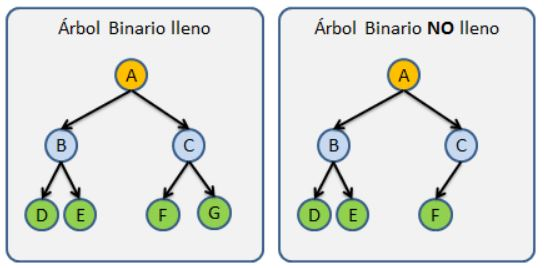
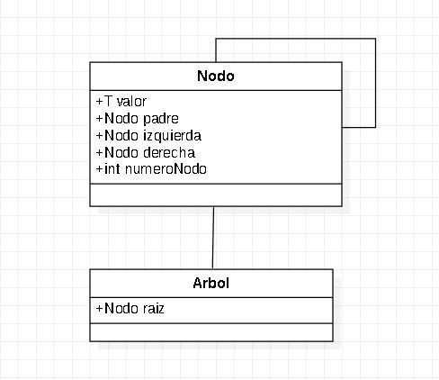

# Estructuras De Datos

## Arbol Binario

Esta estructura se caracteriza por que cada nodo padre solo puede tener máximo 2 hijos.

Los Árboles son las estructuras de datos mas utilizadas, pero también una de las mas complejas, Los Árboles se caracterizan por almacenar sus nodos en forma jerárquica y no en forma lineal como las Listas Ligadas, Colas,Pilas,etc.

## Arbol Binario LLeno y No LLeno

  

### Diagrama De Clases Arbol Binario

  

