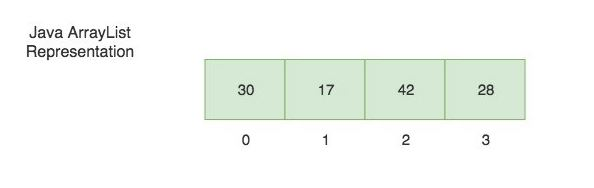
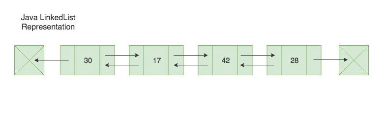
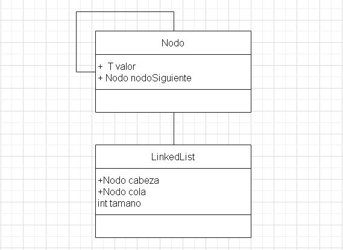

# Estructuras De Datos

## ArrayList

ArrayList se utiliza para almacenar una colección de elementos de tamaño dinámico. A diferencia de los arrays que tienen un tamaño fijo, una ArrayList aumenta su tamaño automáticamente cuando se le agregan nuevos elementos.
ArrayList implementa la interfaz List.

### ArrayList

  

## LinkedList

Los LinkedList se encuentran entre las estructuras de datos más simples y comunes. Se pueden usar para implementar varios otros tipos de datos abstractos comunes, incluidas listas, pilas, colas, matrices asociativas y expresiones S, aunque no es raro implementar esas estructuras de datos directamente sin usar una lista vinculada como base.

El principal beneficio de una LinkedList sobre una matriz convencional es que los elementos de la lista se pueden insertar o eliminar fácilmente sin reasignar o reorganizar toda la estructura porque los elementos de datos no necesitan almacenarse contiguos en la memoria o en el disco, mientras se reestructura una matriz en el tiempo de ejecución es una operación mucho más cara. Las listas enlazadas permiten la inserción y eliminación de nodos en cualquier punto de la lista, y permiten hacerlo con un número constante de operaciones manteniendo el enlace anterior al enlace que se agrega o elimina en la memoria durante el recorrido de la lista.

### LinkedList

  

### Diagrama De Clases LinkedList

  

