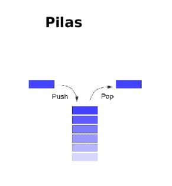
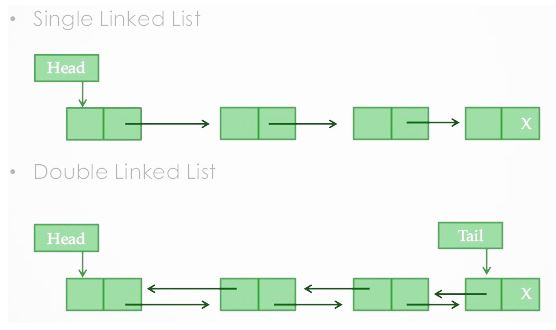
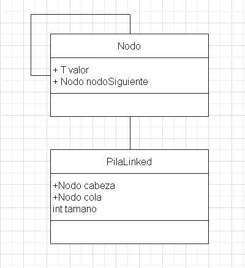
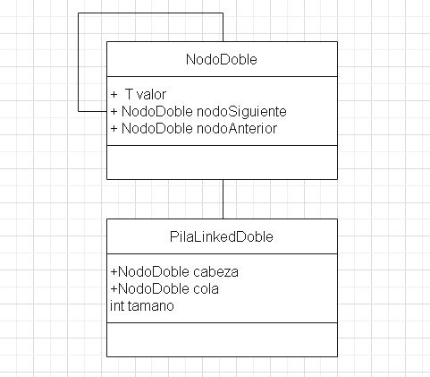

# Estructuras De Datos

## Pila

Una pila (stack en inglés) es una lista ordinal o estructura de datos en la que el modo de acceso a sus elementos es de tipo LIFO (del inglés Last In First Out, último en entrar, primero en salir) que permite almacenar y recuperar datos. Se aplica en multitud de ocasiones en informática debido a su simplicidad y ordenación implícita en la propia estructura. Representación gráfica de una pila

Para el manejo de los datos se cuenta con dos operaciones básicas: apilar (push), que coloca un objeto en la pila, y su operación inversa, retirar (o desapilar, pop), que retira el último elemento apilado.

En cada momento sólo se tiene acceso a la parte superior de la pila, es decir, al último objeto apilado (denominado TOS, Top of Stack en inglés). La operación retirar permite la obtención de este elemento, que es retirado de la pila permitiendo el acceso al siguiente (apilado con anterioridad), que pasa a ser el nuevo TOS.

  

## Pila With LinkedList

  

### Diagrama De Clases Pila LinkedList

  

### Diagrama De Clases Pila LinkedList Doble

  

