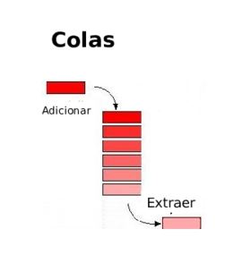
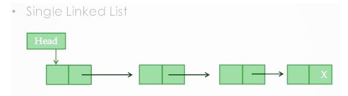
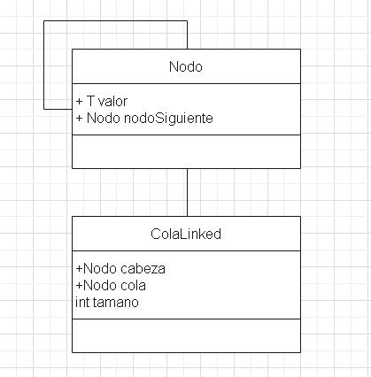

# Estructuras De Datos

## Cola

Una cola es una estructura de datos, caracterizada por ser una secuencia de elementos en la que la operación de inserción push se realiza por un extremo y la operación de extracción pop por el otro. También se le llama estructura FIFO (del inglés First In First Out), debido a que el primer elemento en entrar será también el primero en salir.

  

## Cola With LinkedList

  

### Diagrama De Clases Cola LinkedList

  

