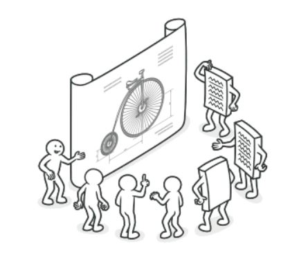

# Patrones De Diseño

Los patrones de diseño son soluciones habituales a problemas que ocurren con frecuencia en el
diseño de software. Son como planos prefabricados que se pueden personalizar para resolver un
problema de diseño recurrente en tu código.

  

## Ventajas

Los patrones son un juego de herramientas que brindan soluciones a problemas habituales
en el diseño de software. Definen un lenguaje común que ayuda a tu equipo a comunicarse
con más eficiencia.

## Clasificacion

Los patrones de diseño varían en su complejidad, nivel de detalle y escala de aplicabilidad.
Además, pueden clasificarse por su propósito y dividirse en tres grupos.

## Patrones Creacionales

## Patrones Estructurales

## Patrones De Comportamiento
