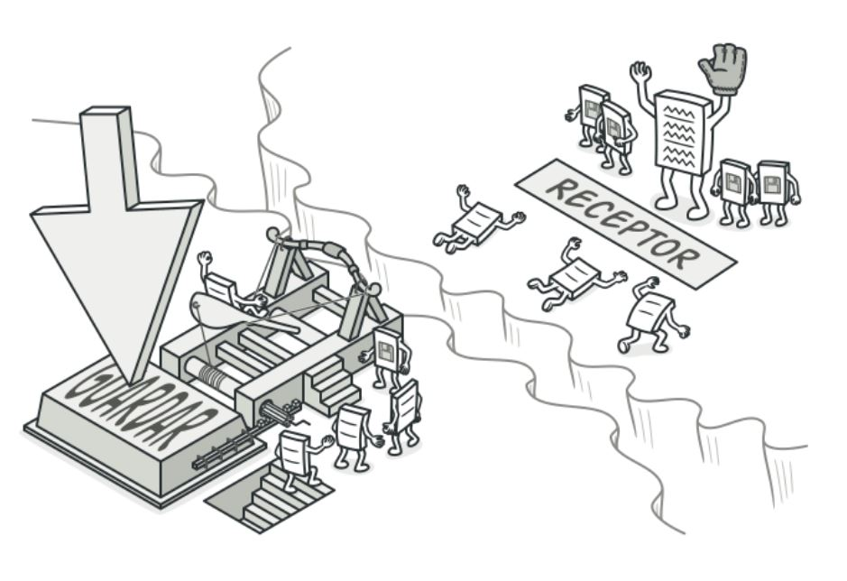
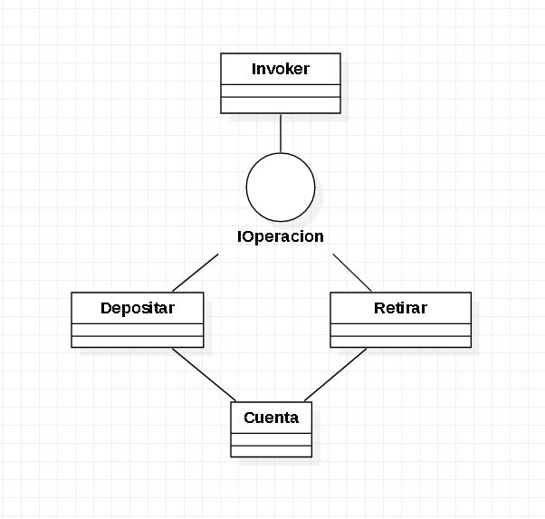

# Command

es un patrón de diseño de comportamiento que convierte una solicitud en un objeto independiente que contiene toda la información sobre la solicitud. Esta transformación te permite parametrizar los métodos con diferentes solicitudes, retrasar o poner en cola la ejecución de una solicitud y soportar operaciones que no se pueden realizar.

  

## Diagrama de Clases

  

