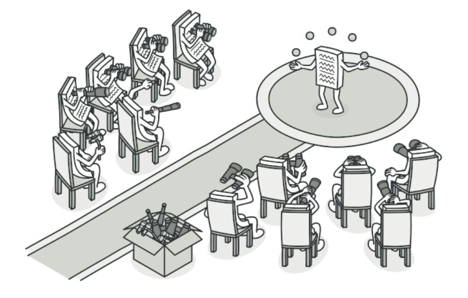
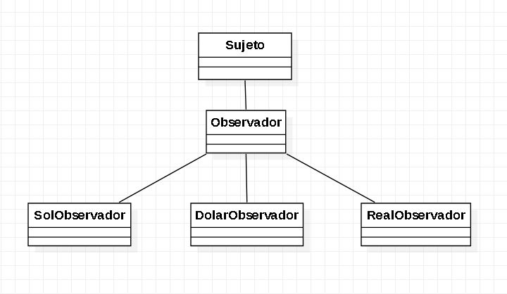

# Observer

es un patrón de diseño de comportamiento que te permite definir un mecanismo de suscripción para notificar a varios objetos sobre cualquier evento que le suceda al objeto que están observando.

  

## Diagrama de Clases

  

