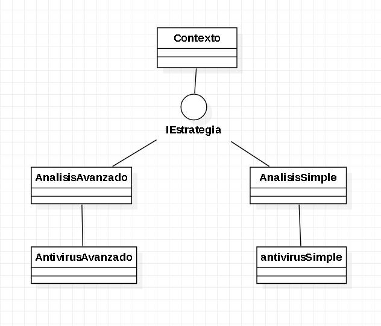

# Strategy

es un patrón de diseño de comportamiento que te permite definir una familia de algoritmos, colocar cada uno de ellos en una clase separada y hacer sus objetos intercambiables.

  

## Diagrama de Clases

  

