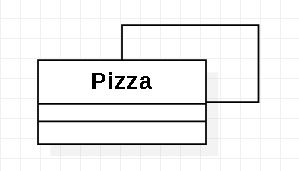

# Builder

Es un patrón de diseño creacional que nos permite construir objetos complejos paso a paso. El patrón nos permite producir distintos tipos y representaciones de un objeto empleando el mismo código de construcción.

  

## Diagrama de Clases

  

