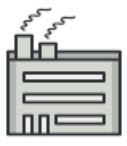
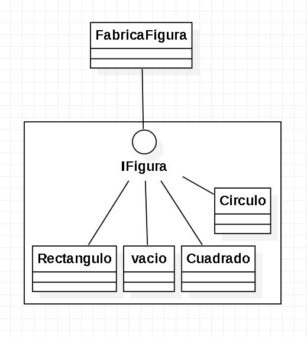

# Factory

se enfoca en la creación de una interface que facilite la creación de objetos que se organizan por diferentes subclases. Esto ocurre con frecuencia cuando se hace uso de la herencia. Una clase abstracta se genera conteniendo los atributos generales, y después se crean clases para objetos específicos. Para evitar llamar constructores específicos se deben crear interfaces que nos ayuden en estas tareas.

  

## Diagrama De Clases

  

