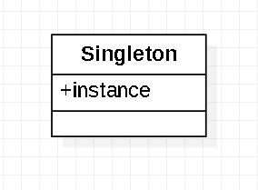

# Singleton

es un patrón de diseño creacional que nos permite asegurarnos de que una clase tenga una única instancia, a la vez que proporciona un punto de acceso global a dicha instancia.

  

## Diagrama De Clases

  

