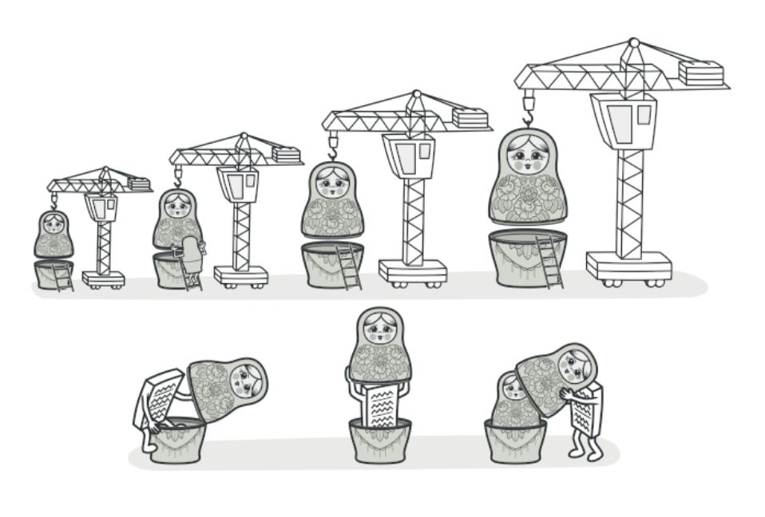
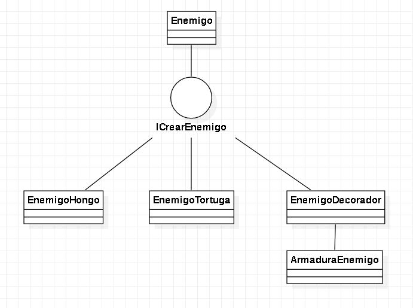

# Decorator

es un patrón de diseño estructural que te permite añadir funcionalidades a objetos colocando estos objetos dentro de objetos encapsuladores especiales que contienen estas funcionalidades.

  

## Diagrama de Clases

  

