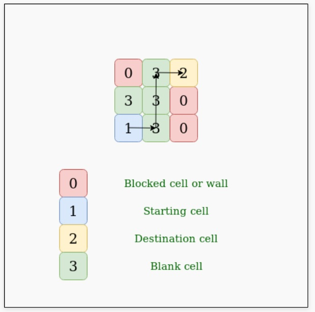
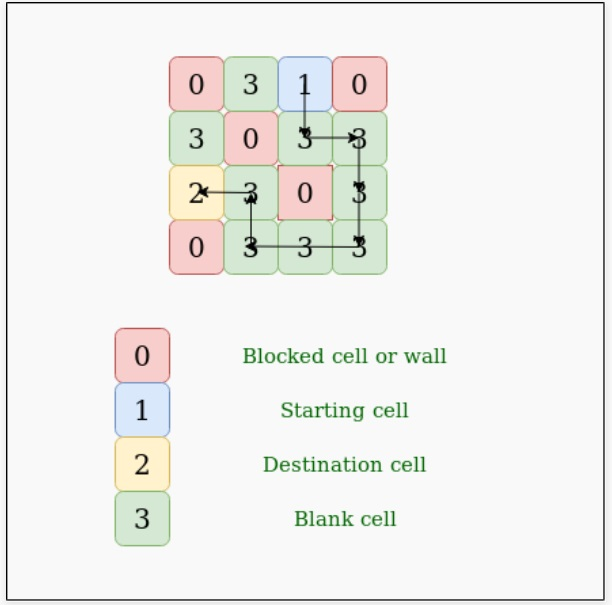

# Matrix Path

Given N X N matrix filled with 1, 0, 2, 3. Find whether there is a path possible 

from source to destination, traversing through blank cells only. You can traverse 

up, down, right, and left. 

* A value of cell 1 means Source.
* A value of cell 2 means Destination.
* A value of cell 3 means Blank cell.
* A value of cell 0 means Wall.

Note: there are an only a single source and single destination(sink). 

Example:

  

  

## Recursion solution

## Graph efficent solution

## Graph efficent and simple solution

Source: https://www.geeksforgeeks.org/find-whether-path-two-cells-matri
